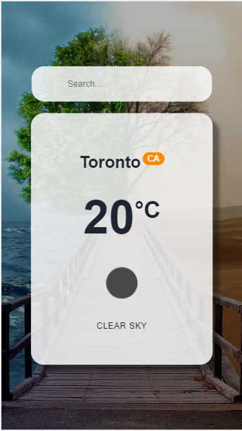
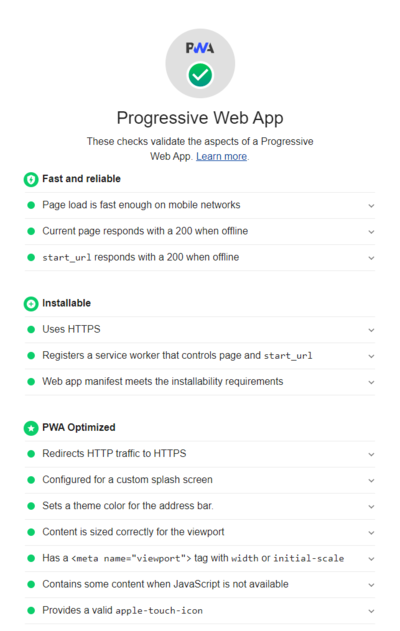

[](https://app.netlify.com/sites/kind-bohr-40c3e6/deploys)


<!-- PROJECT LOGO -->
<br />
<p align="center">
    

  <h3 align="center">Weather PWA</h3>

  <p align="center">
    An awesome Weather PWA App!
    <br />
    <br />
    <a href="https://kind-bohr-40c3e6.netlify.app/">View Demo</a>
    ·
    <a href="https://github.com/RobertoNobre/weather-pwa/issues">Report Bug</a>
    ·
    <a href="https://github.com/RobertoNobre/weather-pwa/issues">Request Feature</a>
  </p>
</p>

<!-- ABOUT THE PROJECT -->
## About The Project

 

This is a Weather app, to know how is around all the cities of the world.

### Built With

* [ReactJs](https://reactjs.org/)
* [TypeScrypt](https://www.typescriptlang.org/)
* [CSS](https://www.w3.org/Style/CSS/Overview.en.html)
* [Axios](https://github.com/axios/axios)


<!-- GETTING STARTED -->
## Getting Started

### Prerequisites

* npm
```sh
npm install npm@latest -g
```
* yarn
```sh
npm install yarn -g
```

### Installation

1. Clone the repo
```sh
git clone https://github.com/RobertoNobre/weather-pwa.git
```
3. Install NPM packages
```sh
yarn
```
4. Run
```JS
yarn start
```

<!-- CONTRIBUTING -->
## Contributing

1. Fork the Project
2. Create your Feature Branch (`git checkout -b feature/AmazingFeature`)
3. Commit your Changes (`git commit -m 'Add some AmazingFeature'`)
4. Push to the Branch (`git push origin feature/AmazingFeature`)
5. Open a Pull Request


<!-- LICENSE -->
## License

Distributed under the MIT License. See `LICENSE` for more information.


<!-- CONTACT -->
## Contact

Roberto Nobre - [@betinhooow](https://www.instagram.com/betinhooow) - rnobre.dev@gmail.com

Project Link: [https://github.com/RobertoNobre/weather-pwa](https://github.com/RobertoNobre/weather-pwa)